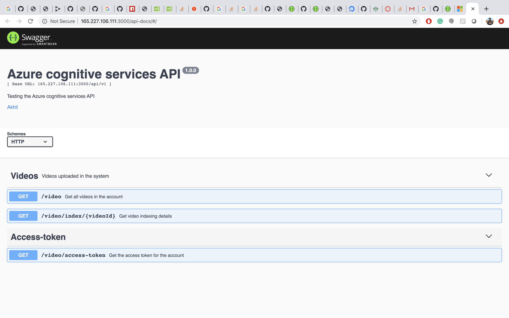
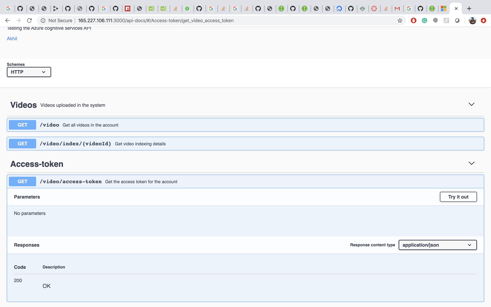
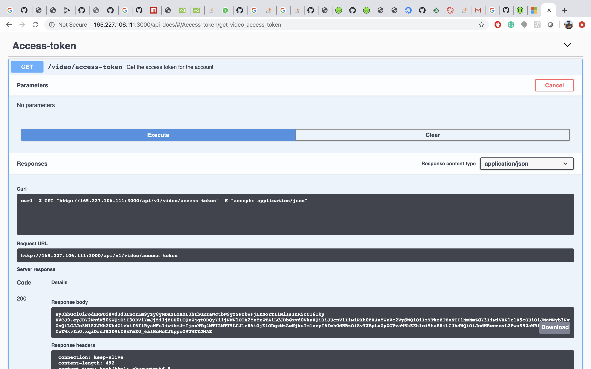
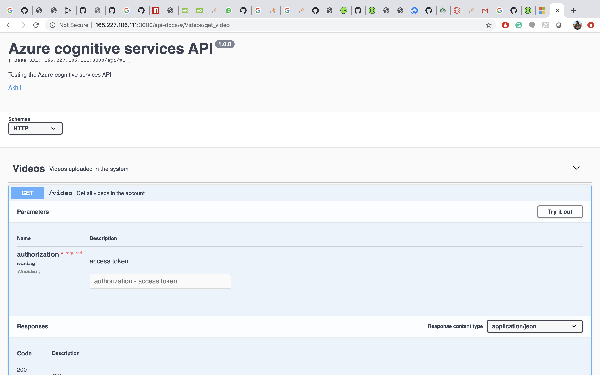
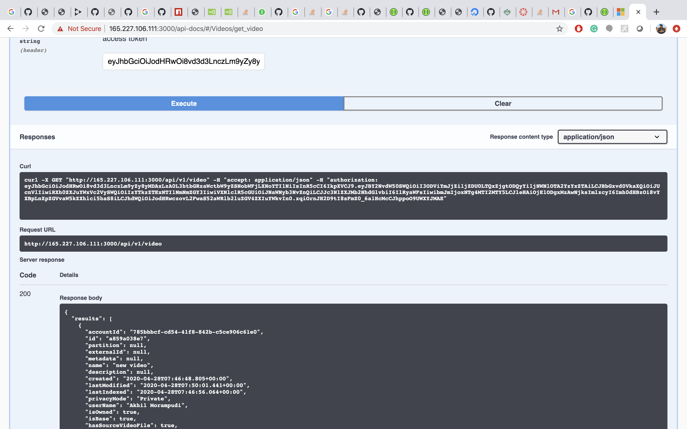
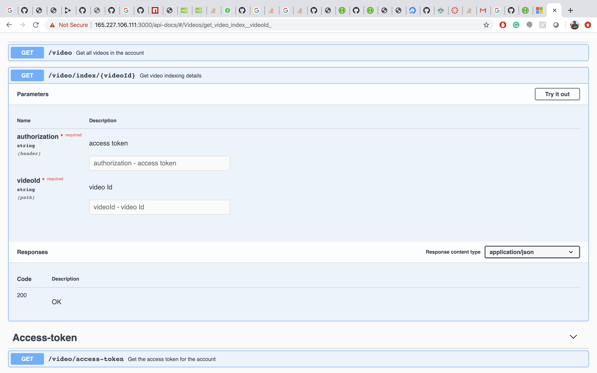
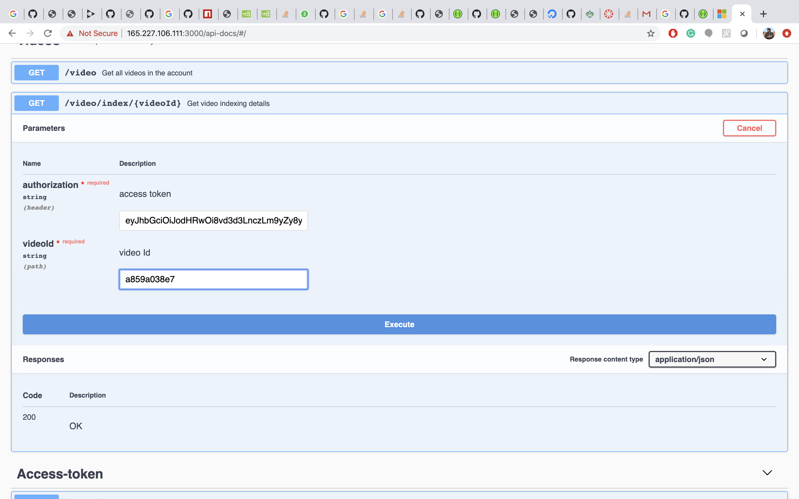
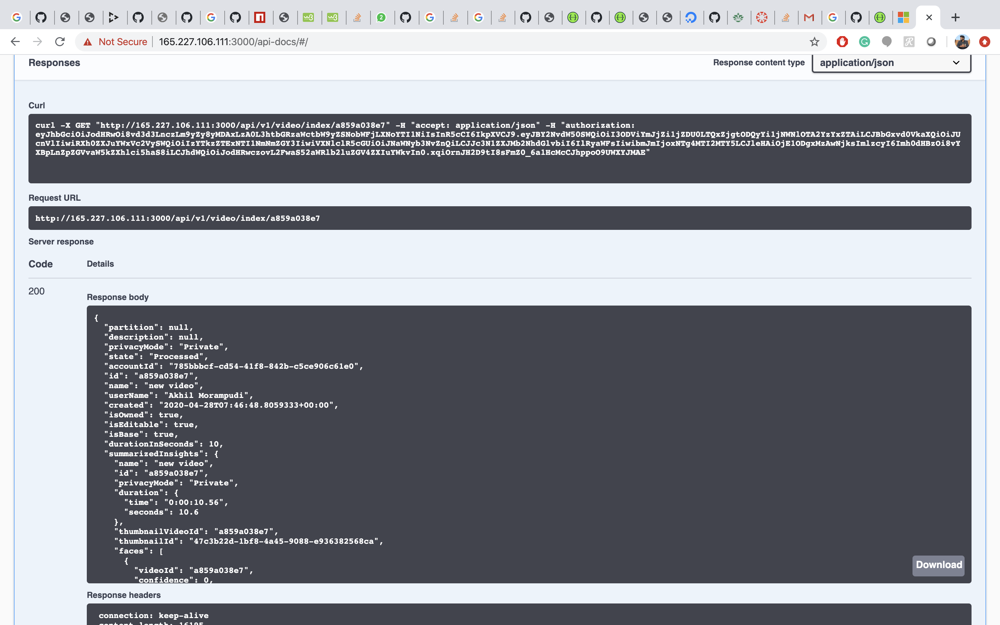

# Azure-Video-Indexer

## Video Indexer:
Video Indexer (VI) is the Azure Media Services AI solution and part of the Azure Cognitive Services brand. Video Indexer provides ability to extract deep insights (with no need for data analysis or coding skills) using machine learning models based on multiple channels (voice, vocals, visual).

## Implementation of Video Indexer using our local API:

As part of the implementation of the video indexer, I have implemented 3 API requests

-	GET API to get the access token for the application.
-	GET API to check the different videos uploaded in the account by giving access token as authorization.
-	GET API to retrieve the indexed details of the particular video by giving access token as the authorization header and video_Id in the path .

Below are the steps provided to use the swagger implementation to retrieve the final result.

## Steps to be followed for acquiring the result from the API:
Step 1:
- Click the URL http://165.227.106.111:3000/api-docs/#/ to open swagger

Step 2:
- Please click on GET option under Access- token and then click on try-out and click on execute.

- Access- token for the API will be displayed in the response body as below

- Access token of the application will be live for only 60mins after the time limit access token will be expired and we need to generate new access token again to use in the application.

Step 3:
- Click on the GET option of /video to retrieve list of all the available videos in the account 
- In order to retrieve the list of videos click on the try it out option and provide the access token generated in the step 2 as the input and click on execute.

- Result has the list of videos with unique id.

### Select one of the videos id to check the video indexer further.

Step 4:
- Please click on GET option under /video/index/{videoId} to check the video indexer of the particular video.

- In order to check the video indexer we need to provide access token which was retrieved in step 2 and video Id retrieved in step 3 as inputs and click on execute.

- Video Indexer of the particular video Id is displayed as below :

